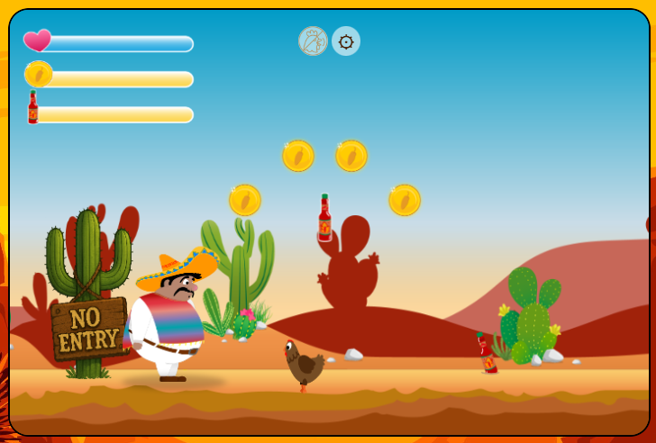
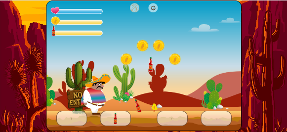

  
# El Pollo Loco

## 🐔 About the Game

In **El Pollo Loco**, you play *Pepe el Peligroso*, the fearless defender of Mexico. A furious gang of rogue chickens, led by the notorious *El Pollo Loco*, is wreaking havoc across the land. Armed only with courage and a few bottles of spicy salsa, Pepe must fight back and restore peace to his homeland. Can you help him roast some chickens?

This project was developed using **HTML**, **CSS**, and **JavaScript**, with a focus on:

- **Object-oriented programming** to structure the game logic
- **HTML5 Canvas** to render the game world and characters
- Custom **JavaScript animations** for characters, movements, and events
- Integrated **background music** and **sound effects** for an immersive experience

All graphics were drawn directly onto the canvas using JavaScript's drawing functions, allowing dynamic rendering and animation without relying on external game engines.

**Live demo**: [Try playing yourself!](https://michelle-bit-web.github.io/el-pollo-loco)

## 🪄 Features

🏃‍➡️ Smooth character movement and jumping.

🌟 Collectable coins and bottles.

🍾 Throwing mechanics to defeat enemies.

🐔 Multiple enemy types with different behaviors.

💥 Endboss fight: El Pollo Loco.

♥️ Animated health bars and sound effects.

🖼️ Start screen and game-over screen.

📱 Responsive design for desktop and mobile.

⏯️ Pause function on control settings.

## 📸 Screenshots

`Mobile phone preview`  

`Desktop preview`  

## ⚙️ Technologies Used

- JavaScript (object-oriented)
- HTML5 Canvas
- CSS for styling
- sound effects and music

## 🚀 How to Play

1. Clone or download the repository.
2. Open `index.html` in your browser. 
3. Press any key (or tap) to start the game.
4. On keyboard use the following controls:

### 🎮 Keyboard Controls:

- `Arrow Left / Right` – Move
- `Space` – Jump
- `D` – Throw bottle
*(Touch controls are automatically enabled on mobile devices.)*

## 📜 License

This project is for educational purposes and not intended for commercial use. Assets are property of their respective owners or used under free licenses.

## 💡To-Dos / Ideas

- [ ] 🦾 Increase the challenge with more levels and difficulty settings
- [ ] 💫 Implement a high score system
   
## 🤓 Author

Created by Michelle Puschkarow.  
Sounds are inspired by various open game assets and retro platformers.
Graphics © Developer Akademie – used with permission for educational purposes. 
If you like this project, feel free to give it a ⭐️ or contribute!

*Have fun playing El Pollo Loco! The chicken won't defeat itself.*